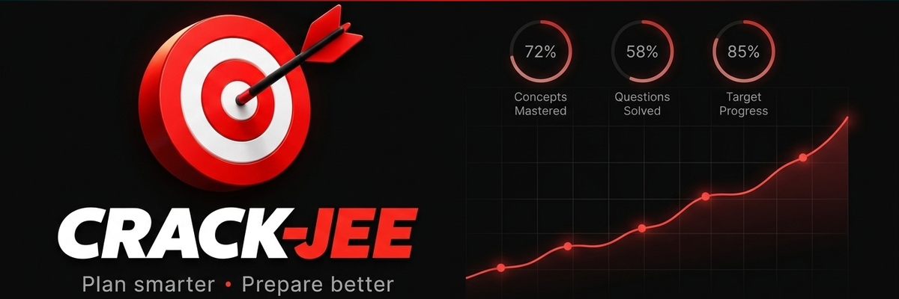

<p align="center">
  
</p>

<p align="center">
  
  
  
  
</p>

<p align="center">
  A personal AI coach for JEE aspirants, built as an MCP server. Not a tutor,
  not a chatbot with a syllabus bolted on — it turns raw test results into a
  closed feedback loop: log what happened, find the patterns a single test
  report can never show, get a concrete next study plan, and verify whether
  it actually worked on the next test.
</p>

<p align="center">
  Free. Local. No subscription, no hosting bill, no data leaving your machine
  except to whatever LLM chat client you connect it to.
</p>

---

## Why

Coaching institute reports are siloed — each test is graded in isolation. Two
things never happen on their own:

1. **Cross-test pattern mining.** The same mistake, on the same concept,
   across five different tests over two months, looks like five unrelated
   bad days unless something is tracking it. CRACK-JEE finds it.
2. **Closed-loop verification.** A coach tells you to fix something. Nobody
   goes back after the next test and checks whether it worked. CRACK-JEE
   does, automatically, every time.

Everything in between — mastery estimation, what's about to be forgotten,
where you're burning time versus actually stuck, skip-vs-wrong strategy
under negative marking — is plain deterministic code, not a trained model.
An LLM only extracts messy input into structured data and writes the study
plan in your coach's voice; every number it reasons over comes from
arithmetic and SQL, not inference.

---

## How it works

```
you describe a test  →  LLM extracts structured data  →  local SQLite log
                                                                │
                                                                ▼
                                            deterministic analytics engine
                                     (mastery, weak spots, revision timing,
                                      time-on-task, skip/negative-marking)
                                                                │
                                                                ▼
                                     LLM reasons over it, writes a real plan
                                                                │
                                                                ▼
                                          next test's results close the loop
```

Connect it to any MCP-capable chat client (Claude Desktop, Qwen Desktop,
etc.) and just talk to it like a coach — describe results in whatever format
you have, ask what to study, mention an upcoming exam and its syllabus.

---

## What it tracks

| Capability | What it answers |
|---|---|
| Weak topics | Which concepts have the worst accuracy — and separates "skipped wisely" from "guessed and got it wrong," since JEE's negative marking makes those different problems |
| Recurring mistakes | Which error types repeat on the same concept across multiple tests — the thing a single per-test report can't show |
| Concept mastery (BKT) | A real probability of knowing each concept, updated after every attempt, with retention decay applied over time |
| Revision due | What's about to be forgotten and should be revised before that happens |
| Time patterns | Whether you're genuinely stuck on a concept (spending much longer on wrong answers) versus just making quick errors |
| Student profile | Overall pace, time-management tendencies, and subject strengths across everything logged so far |
| Exam planning | A full study plan for an upcoming exam's syllabus, accounting for topics you haven't touched yet |
| Progress verification | Before/after accuracy on a concept or exam once a plan has been acted on — the closed loop |

17 MCP tools total, covering logging, analytics, daily planning, exam
planning, and progress verification. See [`docs/plan.md`](docs/plan.md) for
the full build history and [`docs/chat-client-system-prompt.md`](docs/chat-client-system-prompt.md)
for exactly how a connected client is expected to use them.

---

## Setup

Requires [Python ≥ 3.10](https://www.python.org/) and
[`uv`](https://github.com/astral-sh/uv).

```bash
uv sync
uv run python src/server.py   # runs the server on stdio for local dev
```

Connect it from any MCP client by pointing it at that command, e.g.:

```json
{
  "mcpServers": {
    "crack-jee": {
      "command": "uv",
      "args": ["run", "--directory", "C:/path/to/CRACK-JEE", "python", "src/server.py"]
    }
  }
}
```

Once published to PyPI, `uvx crack-jee` will work with zero
local install — see [`docs/setup.md`](docs/setup.md) for exact commands and
[`docs/production-readiness-notes.md`](docs/production-readiness-notes.md)
for what's left before that.

### Test

```bash
uv run pytest tests/ -v
```

---

## Design principles

- **Deterministic core, LLM at the edges.** The LLM extracts and writes
  plans in natural language; every mastery estimate, ranking, and trend is
  plain code — reproducible, debuggable, and free to run.
- **Fixed-parameter BKT, not a trained model.** A single student's few
  hundred attempts is a different data regime than the population-scale
  data DKT/AKT/SAINT-style models need. See [`ex1.md §7`](ex1.md) for the
  full reasoning, and [`research/synthetic_jee_kt/`](research/synthetic_jee_kt/)
  for the benchmark that backs the decision.
- **Never invents an answer.** If a tool call fails on bad input or
  something's ambiguous, the client is instructed to ask rather than guess
  and log something wrong into your history.
- **Exam-agnostic.** Nothing hardcodes JEE's subjects or syllabus — concept
  and subject are free-text fields set by whoever logs the data. Works the
  same for any exam; JEE is just what it was built for.

Full rationale for every non-obvious decision, including rejected
approaches, is in [`docs/decisions.md`](docs/decisions.md) (append-only
log) and [`ex1.md`](ex1.md).

---

## Project structure

```
CRACK-JEE/
├── src/
│   ├── server.py       # FastMCP server entrypoint
│   ├── db.py            # SQLite schema, queries, concept dedup
│   ├── bkt.py            # BKT closed-form Bayesian update + retention decay
│   └── tools/            # One file per MCP tool, registered in server.py
├── tests/                # Test suite (pytest)
├── research/synthetic_jee_kt/   # Independent KT-model benchmark, not part of the server
├── docs/                 # Design docs, decision log, setup instructions
├── presentation/         # Hackathon deck source + related notes, not part of the server
└── pyproject.toml
```

---

## License

MIT — see [`LICENSE`](LICENSE).
